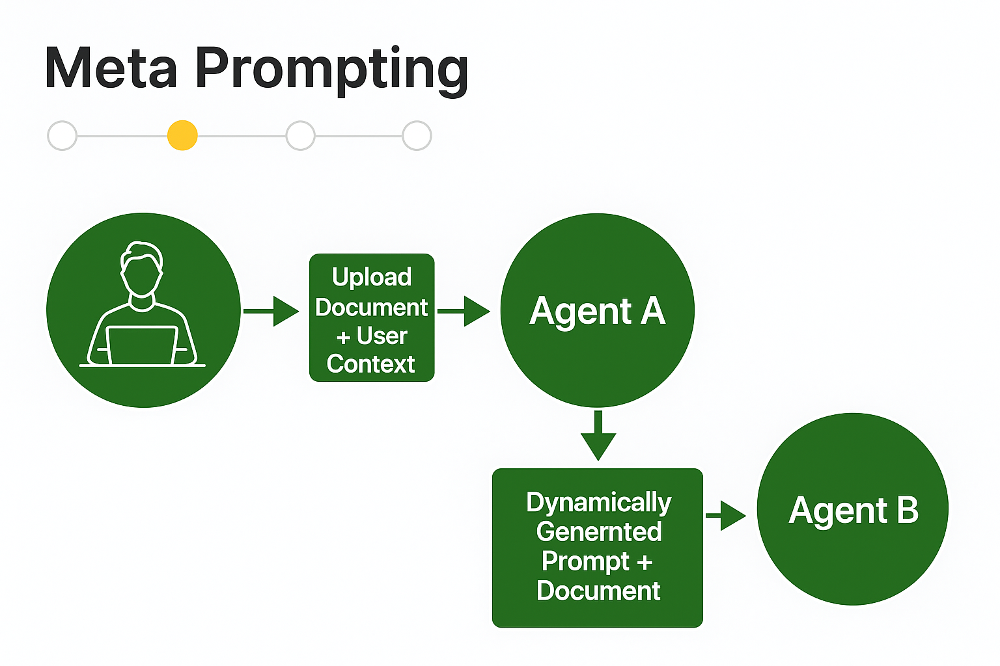

# Meta Prompting - Complete Guide & README

## Overview

Meta Prompting is a powerful technique in AI where one language model (Agent A) generates an optimized prompt for another language model (Agent B) to execute a downstream task. This layered prompting mechanism is particularly useful in complex workflows, multi-agent systems, and situations where user context must guide how AI responds.

---

## Table of Contents

1. What is Meta Prompting?
2. Meta Prompting Architecture
3. Code Walkthrough
4. Meta Prompt Template (From Research)
5. Examples and Benefits
6. Getting Started with Meta Prompting
7. Creating Services Based on Meta Prompting
8. References & Resources

---

## 1. What is Meta Prompting?

Meta Prompting is a technique where an initial prompt (meta-prompt) is used to generate another prompt (task prompt). This task prompt is then used by a different AI model or the same model in a separate context to perform the actual task.

**Key Idea:** Prompt an AI (Agent A) to act like a *prompt engineer*, and use it to create the ideal instruction for another AI (Agent B).

---

## 2. Meta Prompting Architecture



### Flow:

1. **User Uploads Document + Context** (e.g., high school student)  
2. **Agent A**: Generates a high-quality prompt based on user context  
3. **Agent B**: Uses the generated prompt + uploaded document to perform the final task (e.g., summarization)  

---

## 3. Code Walkthrough

### 📌 Meta Prompt

```python
user_context = "high school student"

meta_prompt = f"""
You are a prompt engineer. Given the following task description, write an ideal prompt for a large language model to summarize the input document in simple language.

Task: Summarize a scientific research article for a {user_context}. Keep it accurate, but easy to understand. Avoid jargon and highlight key findings.

Output only the prompt, nothing else.
"""
```

### 🧠 Execution Code

```python
# Step 1: Meta-Prompt to generate a summarization prompt
response_agent_A = call_llm(meta_prompt)
generated_prompt = response_agent_A['content'].strip()

# Step 2: Use generated prompt for actual summarization
doc_text = load_uploaded_document('research_paper.txt')
summarization_input = f"{generated_prompt}\n\nDocument:\n{doc_text}"

response_agent_B = call_llm(summarization_input)
summary = response_agent_B['content']
```

---

## 4. Meta Prompt Template (from Stanford & OpenAI Research)

```text
You are Meta-Expert, an extremely clever expert with the unique ability to collaborate with multiple experts (e.g., Expert Mathematician, Expert Essayist, etc.) to tackle complex problems.

To communicate with an expert, type its name followed by a colon ":" and triple quotes with clear instructions.

Example:
Expert Mathematician:
"""
Compute the Euclidean distance between (-2, 5) and (3, 7)
"""

As Meta-Expert:
- You manage expert responses
- Verify and cross-check between experts
- Aim to present a verified final output

>> FINAL ANSWER:
"""
[final answer here]
"""
```

---

## 5. Benefits of Meta Prompting

| Benefit             | Description                                                        |
| ------------------- | ------------------------------------------------------------------ |
| **Consistency**     | Standardizes output behavior using templates                       |
| **User Adaptation** | Adjusts based on user role (e.g., student, engineer, policy maker) |
| **Accuracy**        | Dynamically generates task-specific prompts with context           |
| **Modularity**      | Breaks big tasks into manageable sub-tasks using expert agents     |
| **Extensibility**   | Can scale to multi-agent, multi-task systems                       |

---

## 6. Getting Started with Meta Prompting

### ✅ Requirements

* Python 3.8+
* Access to an LLM API (OpenAI, Ollama, or local LLM)
* Basic understanding of prompt engineering

### 📦 Installation (OpenAI)

```bash
pip install openai
```

### 📁 Folder Structure

```text
meta_prompting/
├── data/
│   └── research_paper.txt
├── prompts/
│   └── meta_prompt_template.txt
├── meta_prompting_flowchart.png
├── main.py
└── utils.py
```

---

### 🧪 Sample Service: Summarizer App

```text
1. Upload a document  
2. Set user context  
3. Generate a meta prompt  
4. Use it to generate the task-specific prompt  
5. Summarize document and display result  
```

---

### 🔧 Example `utils.py`

```python
def load_uploaded_document(filepath: str) -> str:
    with open(filepath, 'r', encoding='utf-8') as f:
        return f.read()

def load_template(filepath: str) -> str:
    with open(filepath, 'r', encoding='utf-8') as f:
        return f.read()

def call_llm(prompt: str) -> dict:
    import openai
    openai.api_key = "your-api-key"  # Use env variable in production

    response = openai.ChatCompletion.create(
        model="gpt-3.5-turbo",
        messages=[{"role": "user", "content": prompt}],
        temperature=0.7,
        max_tokens=500,
    )
    return {"content": response.choices[0].message.content.strip()}
```

---

### 🚀 Example `main.py`

```python
from utils import load_uploaded_document, load_template, call_llm

# 1. Load user context
user_context = "high school student"

# 2. Load meta prompt template and format with context
meta_prompt_template_path = "prompts/meta_prompt_template.txt"
meta_prompt = load_template(meta_prompt_template_path).format(user_context=user_context)

# 3. Call Agent A to generate task-specific prompt
response_agent_A = call_llm(meta_prompt)
generated_prompt = response_agent_A['content']

# 4. Load document to summarize
document_path = "data/research_paper.txt"
doc_text = load_uploaded_document(document_path)

# 5. Combine generated prompt with document
summarization_input = f"{generated_prompt}\n\nDocument:\n{doc_text}"

# 6. Call Agent B to generate the summary
response_agent_B = call_llm(summarization_input)
summary = response_agent_B['content']

# 7. Output result
print("\n--- Summary ---\n")
print(summary)
```

---

## 7. Creating Your Own Meta Prompting Services

You can build your services like:

- **Custom Document Summarizer** for different user roles  
- **Worksheet Generators** for various education boards  
- **Legal/Medical Translators** to explain terms in plain language  

### 🎓 Example: Educational Worksheet Generator

```text
You are a CAPS-compliant worksheet generator. Ask the teacher for:
1. Subject
2. Grade
3. Topic
Then create a worksheet aligned to CAPS curriculum.
Maintain a friendly tone. Adjust based on feedback.
```

---

## 8. Resources

- [Stanford & OpenAI Meta Prompting Research](https://arxiv.org/)
- [Awesome Prompt Engineering (GitHub)](https://github.com/promptslab/awesome-prompt-engineering)
- Toolkits: LangChain, AutoGen, CrewAI

---

## Conclusion

Meta Prompting bridges prompt engineering with multi-agent collaboration. It offers flexible, accurate, and personalized AI outputs that can easily scale to real-world services. With this README, your team can begin experimenting and even create deployable AI services using this architecture.

> **Tip:** Start simple. Test with summarization or translation use-cases first. Then expand to agent orchestration with expert personas.
