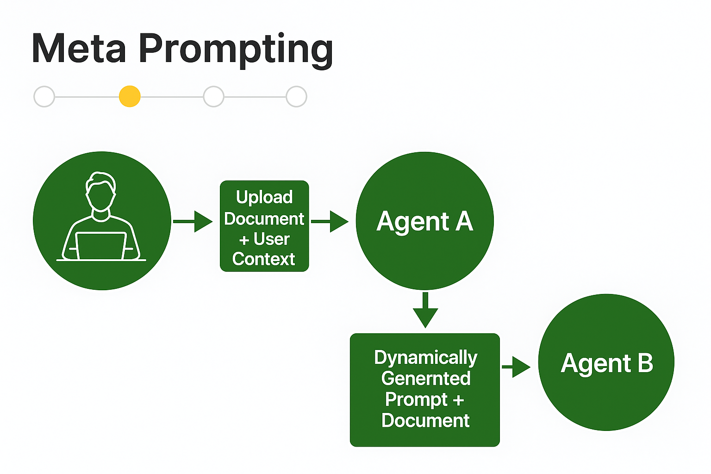

# 🧠 Meta Prompting: A Practical Guide to Prompt Engineering for Better LLM Output

---

## 📘 Table of Contents

1. What is Meta Prompting?
2. Why is Meta Prompting Useful?
3. How Does It Work?
4. Basic Meta Prompt Template
5. Step-by-Step Walkthrough
6. Common Use Case: Text Summarization
7. Advanced Features
8. Experiment with Your Own Prompts
9. Visual Flowchart
10. Final Thoughts

---

## 🔍 What is Meta Prompting?


**Meta Prompting** is a technique that provides a **high-level structural template** to guide *how* a language model (LLM) should think — not *what* to think. It is:

- **Example-agnostic**: Unlike few-shot prompting that uses specific examples, meta prompting focuses on generalizable procedures.
- **Instructional**: It gives formal guidance on **how to solve** a category of problems, rather than performing the task directly.
- **Reusable**: The structure can be applied across many similar tasks.

In simple terms:  
> **Meta Prompting is a prompt about a prompt.**  
It tells the language model how to **rewrite, improve, or structure** another prompt to achieve better reasoning or output.

---

## 🆚 Few-Shot vs Meta Prompting

| Feature           | Few-Shot Prompting              | Meta Prompting                           |
|------------------|----------------------------------|-------------------------------------------|
| Uses Examples     | ✅ Yes                           | ❌ No                                      |
| Reusable Structure| ❌ No                            | ✅ Yes                                     |
| Focus             | Output content                  | Reasoning and process                     |
| Flexibility       | Limited to given examples       | Generalizable across many tasks           |

---


Rather than directly asking an LLM to do something like “Summarize this news article,” you first ask the model to **generate a better prompt** for that task, using best practices in prompt engineering — structure, clarity, and completeness.

This makes it possible to:

- Increase the effectiveness of prompts
- Reduce hallucination
- Standardize prompt formatting
- Enable reusable and dynamic prompt generation

---

## 🎯 Why is Meta Prompting Useful?

Meta Prompting provides a layer of abstraction between users and model commands. Its key benefits:

- ✅ Improves prompt quality using expert instructions
- ✅ Makes prompts consistent and structured
- ✅ Easy to scale across use cases like summarization, translation, classification
- ✅ Teaches new users how to write effective prompts
- ✅ Can serve as a teaching or debugging tool for prompt writers

---

## ⚙️ How Does It Work?

You write a *meta-prompt* — a prompt that takes in a simple or raw prompt and returns a polished, structured, and optimized version of it.

For example:

```python
meta_prompt = """
Improve the following prompt to generate a more detailed summary. 
Adhere to prompt engineering best practices. 
Make sure the structure is clear and intuitive and contains the type of news, tags and sentiment analysis.

{simple_prompt}

Only return the improved prompt.
"""
```

Then, you pass a raw prompt like:

```python
simple_prompt = "Summarize the news article"
```

The model will return something like:

```
You are a summarization assistant. Your task is to generate a structured summary of the following news article. Include:
- A concise summary (3-4 sentences)
- The category of news (e.g., Politics, Technology, Health)
- Relevant tags
- Sentiment of the article (Positive/Negative/Neutral)

Article: {content}
```

This “improved prompt” is now ready to be used for better LLM output.

---

## 🧪 Basic Meta Prompt Template

Here is a reusable template you can copy/paste into any script or notebook:

```python
meta_prompt_template = """
You are an expert in prompt engineering. Your task is to improve the prompt given below.

Instructions:
- Optimize for clarity and completeness
- Ensure the prompt has a defined structure
- Add fields for metadata (e.g., tags, tone, type)
- Focus on general-purpose summarization and classification

Prompt to improve:
{user_prompt}

Return only the improved prompt, no explanations.
"""
```

---

## 🧭 Step-by-Step Walkthrough

1. **Start with a raw or simple user prompt**  
   Example: `"Summarize this text"`

2. **Feed that into the meta-prompt**  
   Example: Inject it into `{user_prompt}` in the meta template

3. **Let the LLM generate an improved prompt**

4. **Use the improved prompt for your actual task**

This process helps ensure quality prompts are consistently generated, especially useful in large systems.

---

## 📄 Common Use Case: Text Summarization

### 🔸 Input (Raw Prompt)

```
Summarize this article about the economic growth in India.
```

### 🔹 Improved Prompt (Generated by Meta Prompt)

```
You are a news summarization assistant. Given the following article, produce a structured summary with:
- A 3-4 sentence abstract
- News category (e.g., Economy)
- Relevant keywords or tags
- Sentiment analysis (Positive/Negative/Neutral)

Article: {article_content}
```

### 🔹 Final Output (After Running Improved Prompt)

```
Summary: India’s GDP has seen a steady 7.5% growth in the last quarter, driven by manufacturing and exports...
Category: Economy
Tags: India, GDP, Manufacturing, Growth
Sentiment: Positive
```

---

## 🚀 Advanced Features

### ✅ Prompt Auditing
Track the differences between the original and improved prompt to learn how structure improves model output.

### ✅ Prompt Versioning
Maintain different templates and iterate on what works better for your context.

### ✅ Use in Chains
Meta prompting can be part of a chain in LangChain or custom frameworks — first generate the prompt, then apply it.

---

## 🧪 Experiment with Your Own Prompts

Here’s a basic script you can use:

```python
from openai import OpenAI

meta_prompt = """
You are an expert prompt engineer. Improve the following prompt with better structure, detail, and clarity. Add classification and sentiment tagging.

Prompt:
{user_prompt}

Return only the improved prompt.
"""

user_prompt = "Summarize the feedback from users"

final_prompt = meta_prompt.format(user_prompt=user_prompt)

# Send final_prompt to LLM to get improved prompt
# Then use the improved prompt to query again
```

---

## 🖼️ Visual Flowchart



---

## 🧠 Final Thoughts

Meta prompting is a powerful, flexible approach to improve LLM performance by first improving how we ask questions. With a well-written meta prompt, we can:

- Build pipelines that self-optimize
- Guide non-experts to write expert-level prompts
- Standardize tasks across teams

Whether you're building summarization tools, classification services, or chatbot assistants — meta prompting can elevate the quality of your outputs dramatically.

---

## 📌 Best Practices Recap

- Use structured prompts with sections and intent
- Include metadata: tags, type, sentiment, etc.
- Don’t directly run user prompts — pass them through meta prompting first
- Test and iterate on your meta prompts
- Keep it simple, readable, and task-focused

---

## ✅ Try It Yourself

Paste this into your notebook:

```python
meta_prompt = """
Improve the following prompt to make it more detailed, structured, and effective for summarization.
Include:
- Summary (3-4 lines)
- News type
- Tags
- Sentiment

{user_prompt}

Return only the improved prompt.
"""

user_prompt = "Summarize the article"

print(meta_prompt.format(user_prompt=user_prompt))
```

---

Happy Prompt Engineering! 🚀
